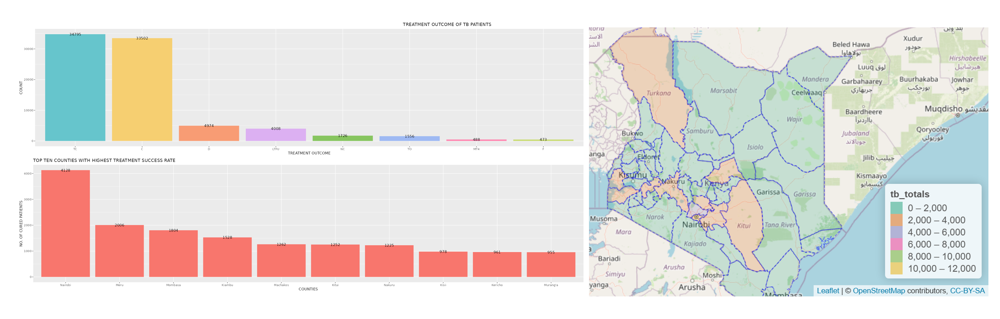

# Tuberculosis Dashboard - Kenya

An interactive data dashboard built in **R** and **Shiny** that visualizes Tuberculosis (TB) trends in Kenya. The app provides an intuitive and engaging interface for users to explore key TB indicators such as case notifications, gender and age distribution, and regional performance.

🔗 **Live App:** [TB Dashboard - Kenya](https://happinessndanu1.shinyapps.io/TB_Kenya/)




---

## 📊 Features

- 📍 TB notifications disaggregated by region
- 🚻 Sex and age distribution of reported TB cases
- 🕒 Trend analysis over time
- 🗂 Filterable views by year, gender, and county
- 📈 Visualizations using `ggplot2`, `plotly`, and `shinydashboard`

---

## 💡 Purpose

This dashboard was created to:
- Provide quick insights into the TB situation in Kenya
- Support public health decision-making
- Serve as a portfolio project to demonstrate Shiny skills in health data analysis

---

## 🛠️ Built With

- [R](https://www.r-project.org/)
- [Shiny](https://shiny.rstudio.com/)
- [ggplot2](https://ggplot2.tidyverse.org/)
- [plotly](https://plotly.com/r/)
- [shinydashboard](https://rstudio.github.io/shinydashboard/)
- [dplyr](https://dplyr.tidyverse.org/)
- [tidyr](https://tidyr.tidyverse.org/)

---

## 📁 How to Run Locally

```r
# Clone this repo
git clone https://github.com/happiness-ndanu/Kenya-TB.git

# Open in RStudio
setwd("TB_Kenya")

# Run the app
shiny::runApp()
```
---
## Author
Happiness Ndanu M

happiness.ndanu.m@gmail.com

Data Analyst| R Developer |Health Data Enthusiast
